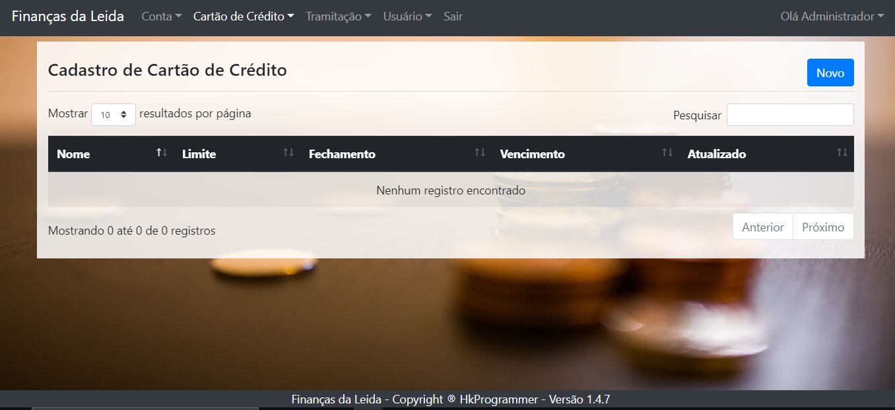
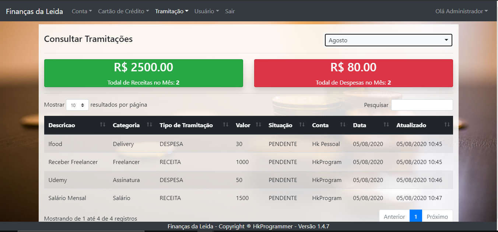

# Finanças da Leida

### Descrição
Finanças da Leida é um sistema de controle financeiro que controla o saldo geral, contas para pagar hoje, receitas para hoje, agenda de contas pendentes, total de receitas por categorias, total de despesas por categoria e total de contas bancarias apresentadas em um dashboard. o Cadastro de tramitações é feito por um formulário, e apresentado em uma datatable.

### Link
[Finanças da Leida](http://financasleidanogueira.com)

### Video Demonstrativo

### Login

### Home

### Contas

### Cadastro de Contas

### Cartão de Crédito

### Cadastro de Cartão de Crédito

### Tramitações

### Cadastro de Tramitações

### Consulta de Tramitações

### Tramitações Pendentes

### Usuários

### Cadastro de Usuários

